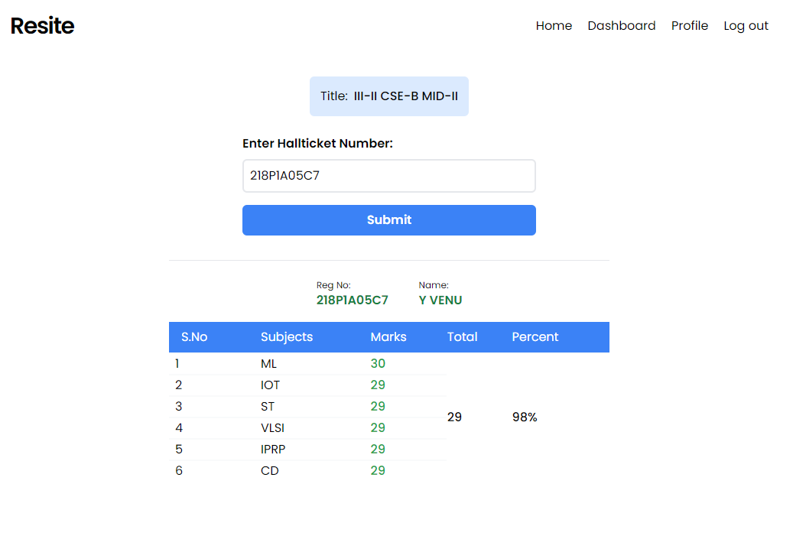

# RESITE

- A web app that publishes the results
- Data related to the results can be through the excel file.
- Built on top of MERN stack
- Simple UI

## Homepage

Homepage shows the links for the latest results.

## Results Page

In this page, by providing the valid Hallticket Number it shows the result.
